```{r setup, include=FALSE}
knitr::opts_chunk$set(echo = FALSE)
# local({
# r <- getOption("repos")
# r["faoswsCRAN"] <- "http://hqlprsws1.hq.un.fao.org/fao-sws-cran/"
# options(repos = r)
# })
## load the library
# library(faosws)
# library(faoswsUtil)
# library(faoswsBalancing)
# library(faoswsStandardization)
library(tinytex)
library(data.table)
library(igraph)
library(stringr)
library(dplyr)
library(MASS) 
library(lattice)
library(reshape2)
library(kableExtra)
library(captioner)
library(xtable)
```

\newpage

\listoffigures

## Disclaimer {-}

This Working Paper should not be reported as representing the official view of
the FAO. The views expressed in this Working Paper are those of the
author and do not necessarily represent those of the FAO or FAO
policy. Working Papers describe research in progress by the authors and
are published to elicit comments and to further discussion.

This paper is dynamically generated on \today{} and is subject to
changes and updates.

\newpage

# The Data flow {-}

This is the first step of the Standardization and Balancing, the step in which data coming from all output dataset are combined in another dataset, which will be the starting point of the following step. It is represented in figure \ref{fig:f1}

```{r f1, fig.align = "center", fig.pos = "H", out.width = "100%",  fig.cap = "\\label{fig:f1}Data pulling"}

knitr::include_graphics("images/pullData/01_pulldata.pdf")
```

Notice that, from *agriculture production* the following Data are pulled: 

 * crop production,
 * livestok,
 * milk and eggs,
 * production of derived commodities,
 * seed,
 * feed.

# Plug-in {-}

A general descriprion of all the objects of the *SWS* is given in the document *Food Balance Sheet workflow in the Statistical Working System*. A plug-in, in this framework, is an executable process. In this document, the steps for executing the *pullDataToSUA* plugin are explained:

# Log-in in the SWS

```{r f2, fig.align = "center", fig.pos = "H", out.width = "100%",  fig.cap = "\\label{fig:f2}Log-in in the SWS"}

knitr::include_graphics("images/pullData/02_swsLogin.pdf")
```

# Open a new Session

```{r f3, fig.align = "center", fig.pos = "H", out.width = "100%",  fig.cap = "\\label{fig:f3}Open a new Session"}

knitr::include_graphics("images/pullData/03_NewSession2.PNG")
```

# Define dimendions of the session

For the Pulling of the data, a session has to be opened in the *target* dataset, which is the *suafbs:sua_unbalanced*. Therefore *SUA/FBS* domain and *sua_unbalanced* have to be selected from the screen:

```{r f4, fig.align = "center", fig.pos = "H", out.width = "100%",  fig.cap = "\\label{fig:f4}Select Domain"}

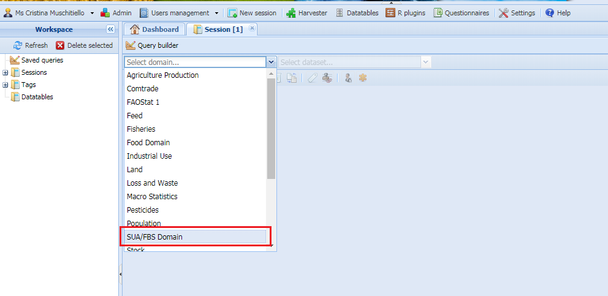
```

```{r f5, fig.align = "center", fig.pos = "H", out.width = "100%",  fig.cap = "\\label{fig:f5}Select Dataset"}

knitr::include_graphics("images/pullData/05_dataset.PNG")
```

\newpage

# Make an run the query

The query has to be done only on the country for which the Pull data has to be performed. Indeed the plugin could be performed on one of the two following set of countries: *session Countries* or *all countries*. In this example *China, Mainland* is selected.
 
```{r f6, fig.align = "center", fig.pos = "H", out.width = "100%",  fig.cap = "\\label{fig:f6}Select Country/ies"}

knitr::include_graphics("images/pullData/06_selectCountry.PNG")
```

All elements here have to be seleted (figure \ref{fig:f7}) and all items(\ref{fig:f8}).
The years to be selected depend on the interest of the user.

```{r f7, fig.align = "center", fig.pos = "H", out.width = "100%",  fig.cap = "\\label{fig:f7}Select all Elements"}

knitr::include_graphics("images/pullData/07_selectElement.PNG")
```


```{r f8, fig.align = "center", fig.pos = "H", out.width = "100%",  fig.cap = "\\label{fig:f8}Select items and years"}

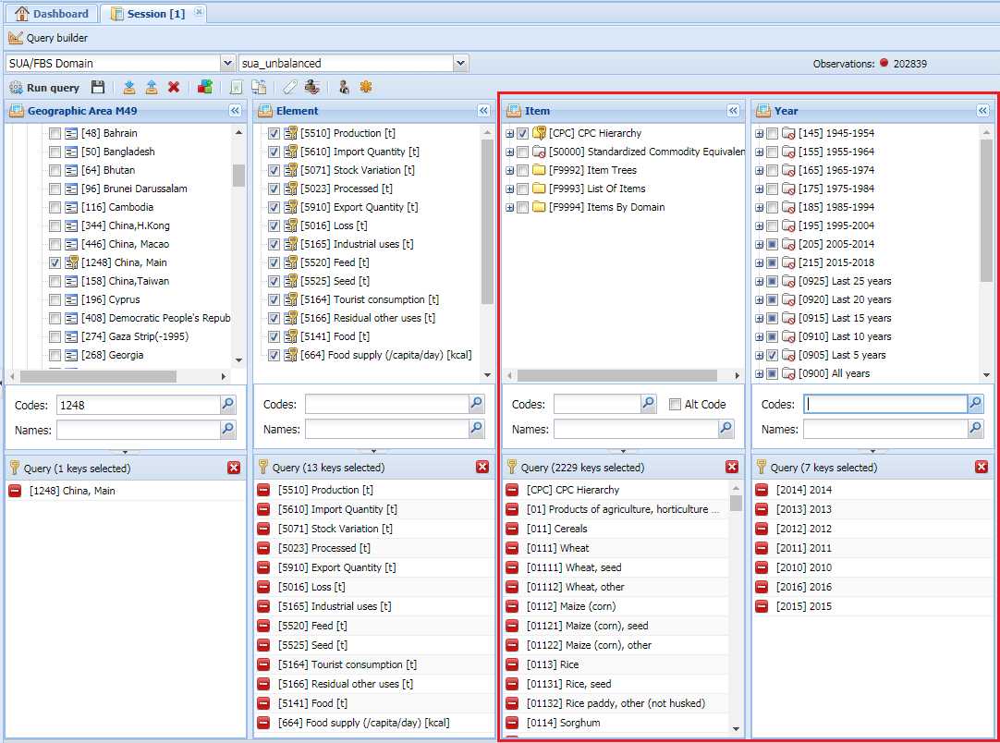
```

When all Variables have been defined, the query can be run:

```{r f9, fig.align = "center", fig.pos = "H", out.width = "100%",  fig.cap = "\\label{fig:f9}Run query"}

knitr::include_graphics("images/pullData/09_run.PNG")
```

```{r f10, fig.align = "center", fig.pos = "H", out.width = "100%",  fig.cap = "\\label{fig:f10}Execution run"}

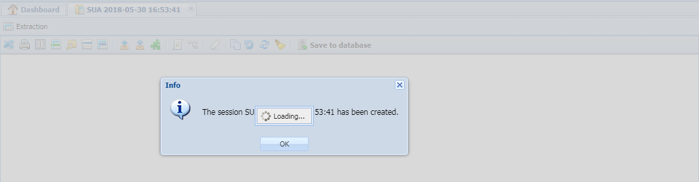
```

# The session

The new swssion is reported in figure \ref{fig:f11}. Items are in the "codelis order", which means in the way they are stored in the SWS. This means that they have a numerical order but there might be some codes in a position not consistent with their number, just because they have been inserted in a different moment in the codelist.

```{r f11, fig.align = "center", fig.pos = "H", out.width = "100%",  fig.cap = "\\label{fig:f11}The new Session"}

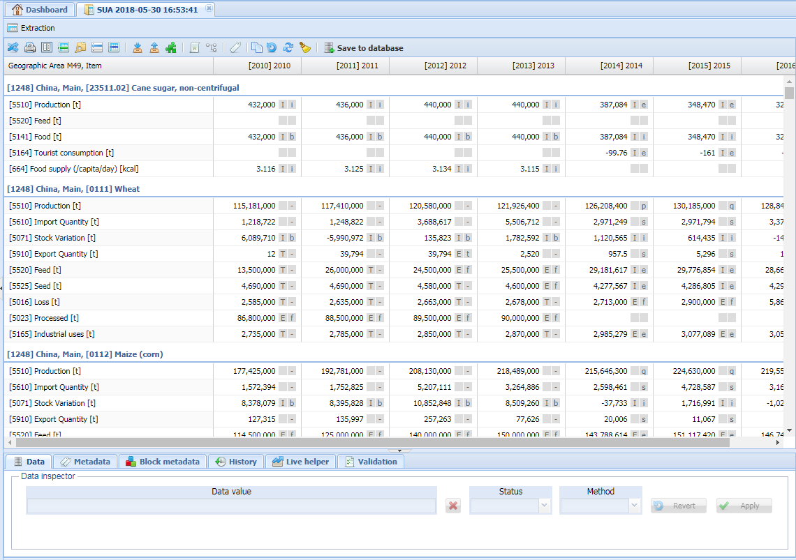
```

*At the moment this dataset is filled with data coming from the old system (dataset "suaValidated2015"), from 2010 to 2013 for* ***all countries***. On these set of data, some changes are made from the users when the FBS are validated. If a data pull is performed in this time range for these countries, the data taken from old system would be overwritten. Is very important to look at the hystory of data and ask for clarofocation to the las persons who saved data.


# Open the plug-in window.

For run the plug-in first the window for the plug-in selection and definition has to be opened (figure \ref{fig:f12}).

```{r f12, fig.align = "center", fig.pos = "H", out.width = "100%",  fig.cap = "\\label{fig:f12}Plug-in botton"}

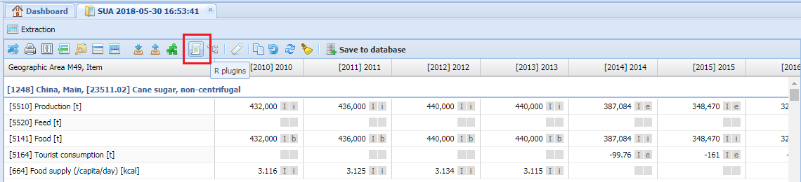
```

In the `script` session, select the plug-in *`pullDataToSUA`* (figures \ref{fig:f13} and \ref{fig:f14}).

```{r f13, fig.align = "center", fig.pos = "H", out.width = "100%",  fig.cap = "\\label{fig:f13}Plug-in window"}

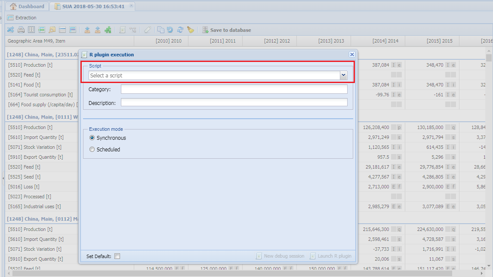
```


```{r f14, fig.align = "center", fig.pos = "H", out.width = "100%",  fig.cap = "\\label{fig:f14}Select Plug-in"}

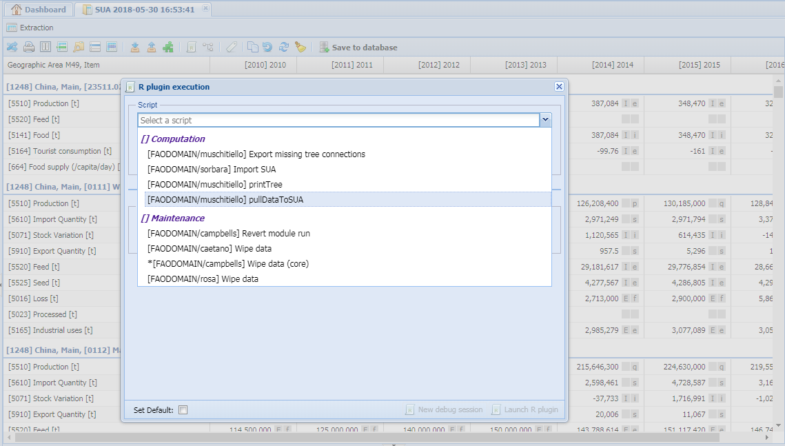
```

This will authomatically bring to a sub-window where the other variables of this plugin can be selected (figure \ref{fig:f15}).

```{r f15, fig.align = "center", fig.pos = "H", out.width = "100%",  fig.cap = "\\label{fig:f15}Select other parameters"}

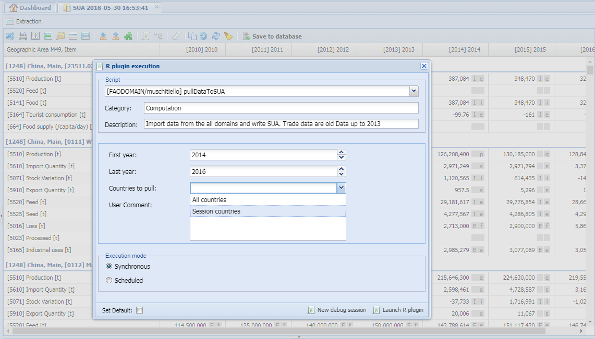
```


 * `First Year`: the year from which data have to be pulled. As previously said, in this dataset there are Validated and old data up tp 2013, therefore in this example 2014 is selected as first year. 
 * `Last Year`: the last year until which the data have to be pulled.
 * `countries to pull`: plugin could be run on "session countries" or "all countries". Time of execution has to be taken into account in this case. To run this plugin on all countries might require almost an hour and generate a session so big that the SWS is not able to handle it.


# Launch Plug-in.

In the *Execution mode* section of the window, the option *`Synchronous`* is selected as default. This option imply that, when the *`Launch R plugin`* button is clicked, the run starts immediately. The other option, *`Scheduled`*, imply that another window is opened for the selection of the time of execution.

When the plug-in has finished to run, a window appears on the screen and an email is sento to the user (figure \ref{fig:f18}).

```{r f16, fig.align = "center", fig.pos = "H", out.width = "100%",  fig.cap = "\\label{fig:f16}Launch plug-in"}

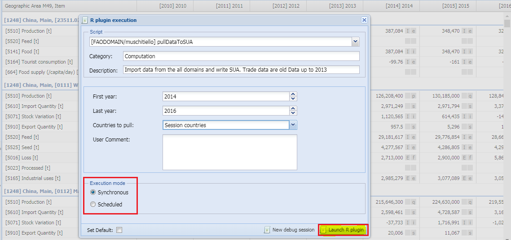
```


```{r f18, fig.align = "center", fig.pos = "H", out.width = "100%",  fig.cap = "\\label{fig:f18}End of plug-in run"}

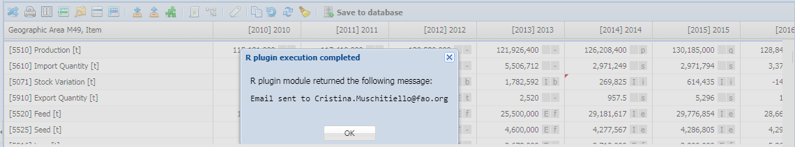
```

# Session updated

In the session, all the figure that have been changed/added from the plug-in have a small red triangle on the top-left side of the figure box (figure \ref{fig:f19}).

```{r f19, fig.align = "center", fig.pos = "H", out.width = "100%",  fig.cap = "\\label{fig:f19}Updated session"}

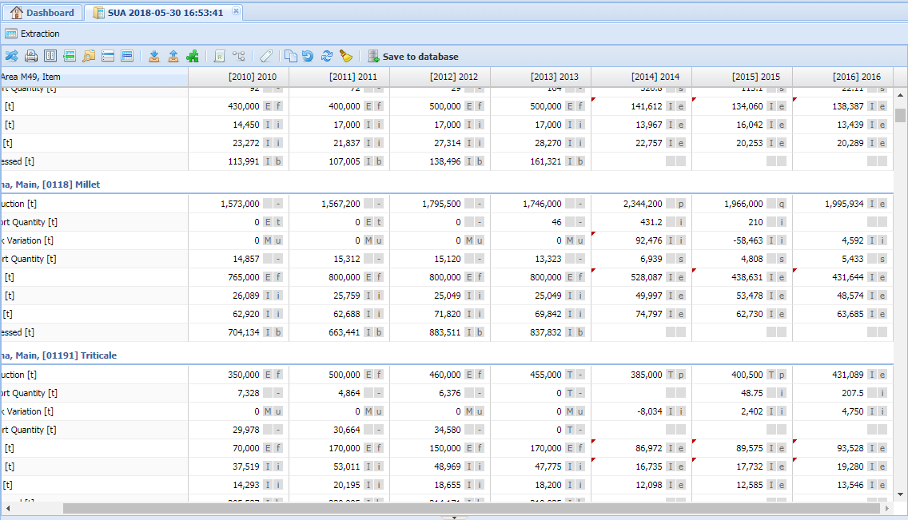
```

# Save back to the database

For the new figures to be used in following steps, the data have to be saved to the database.

```{r f20, fig.align = "center", fig.pos = "H", out.width = "100%",  fig.cap = "\\label{fig:f20}Save to Database"}

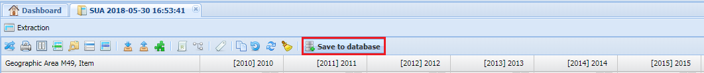
```


