```{r setup, include=FALSE}
knitr::opts_chunk$set(echo = FALSE)
# local({
# r <- getOption("repos")
# r["faoswsCRAN"] <- "http://hqlprsws1.hq.un.fao.org/fao-sws-cran/"
# options(repos = r)
# })
## load the library
# library(faosws)
# library(faoswsUtil)
# library(faoswsBalancing)
# library(faoswsStandardization)
library(tinytex)
library(data.table)
library(igraph)
library(stringr)
library(dplyr)
library(MASS) 
library(lattice)
library(reshape2)
library(kableExtra)
library(captioner)
library(xtable)
```

\listoffigures

## Disclaimer {-}

This Working Paper should not be reported as representing the official view of
the FAO. The views expressed in this Working Paper are those of the
author and do not necessarily represent those of the FAO or FAO
policy. Working Papers describe research in progress by the authors and
are published to elicit comments and to further discussion.

This paper is dynamically generated on \today{} and is subject to
changes and updates.

\newpage

# The Data flow {-}

The data Flow of the Standardization and Balancing Plugin is reported in \ref{fig:f1}.
For detail about the methodology, please see the document *Standardization & Balancing for Food Balance Sheet Calculation*. 

```{r f1, fig.align = "center", fig.pos = "H", out.width = "70%",  fig.cap = "\\label{fig:f1}Data Flow of Standardizatrion and Balancing"}

knitr::include_graphics("images/standPlugin/01_dataFlow.pdf")
```

The *Standardization and Balancing* involves 5 *datasets* and 4 *data tables* in the SWS.
One peculiarity of this plug-in is that is saves data in 3 different data-sets. As a consequence, for executing it, it is necessary to open 3+1 sessions (3 for the output data-sets and 1 for the input data-set).

# Log-in in the SWS

```{r f2, fig.align = "center", fig.pos = "H", out.width = "100%",  fig.cap = "\\label{fig:f2}Log-in in the SWS"}

knitr::include_graphics("images/standPlugin/02_swsLogin.pdf")
```

# Data Pull

First. data from different data-sets have to be pulled inside the `sua-unbalanced` data-set and save the data back. This step is performed trough a plug-in called `pullDataToSua` which is documented in a separate document. A general workflow would probably start from the pulling pf all data for all countries, which are then saved in the SWS for all the users to start producing FBSs on single countries.

# Open The Sessions.

4 sessions have to be opened, each one has to be named. This is not mandatory, but is important enough for reducing confusion and risk error when the plug-in has to be run.
For this document an example on China Mainland, years from 2010 to 2016 is used.

## `sua-unbalanced` session

This is the session on the *input* data-set. After having used the *New-session* button, this session has to be opened in the *suafbs:sua_unbalanced*. Therefore *SUA/FBS* domain and *sua_unbalanced* have to be selected from the screen (figures \ref{fig:f3} to \ref{fig:f5}).

```{r f3, fig.align = "center", fig.pos = "H", out.width = "100%",  fig.cap = "\\label{fig:f3}Open a new Session"}

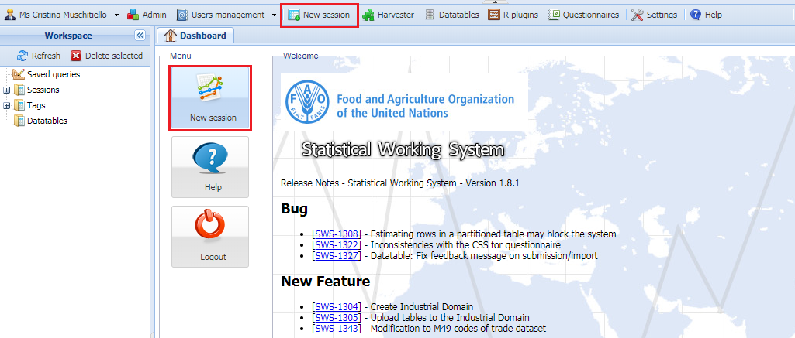
```


```{r f4, fig.align = "center", fig.pos = "H", out.width = "100%",  fig.cap = "\\label{fig:f4}Select Domain"}

knitr::include_graphics("images/standPlugin/04_domain.PNG")
```

```{r f5, fig.align = "center", fig.pos = "H", out.width = "100%",  fig.cap = "\\label{fig:f5}Select Dataset"}

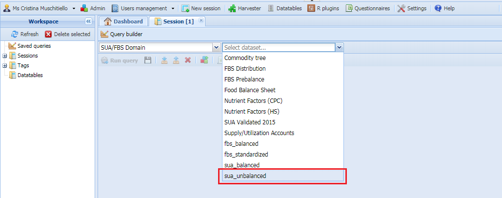
```

### Make and run the query on this session

The query has to be done only on the country for which the Pull data has to be performed. Indeed the plugin could be performed on one of the two following set of countries: *session Countries* or *all countries*. In our example *China, Mainland* is selected.
 
```{r f6, fig.align = "center", fig.pos = "H", out.width = "100%",  fig.cap = "\\label{fig:f6}Select Country/ies"}

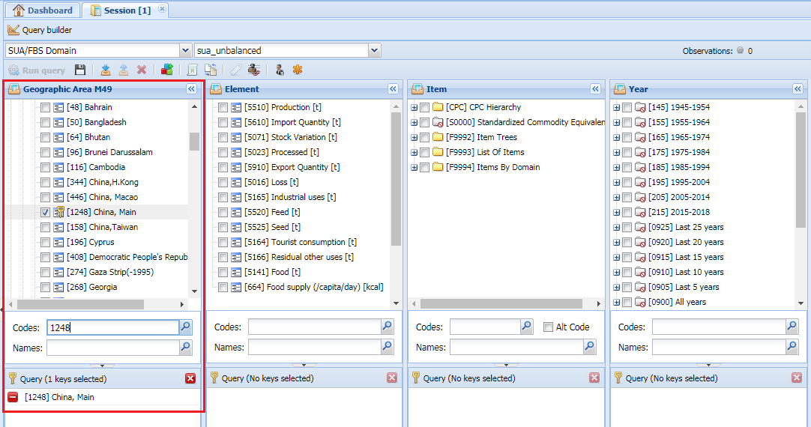
```

All elements here have to be selected (figure \ref{fig:f7}) and all items (figure \ref{fig:f8}).
The years to be selected depend on the interest of the user. In this example the time range 2010:2016 is used

```{r f7, fig.align = "center", fig.pos = "H", out.width = "100%",  fig.cap = "\\label{fig:f7}Select all Elements"}

knitr::include_graphics("images/standPlugin/07_selectElement.PNG")
```


```{r f8, fig.align = "center", fig.pos = "H", out.width = "100%",  fig.cap = "\\label{fig:f8}Select items and years"}

knitr::include_graphics("images/standPlugin/08_selectItemYear.PNG")
```

When all Variables have been defined, the query can be run:

```{r f9, fig.align = "center", fig.pos = "H", out.width = "100%",  fig.cap = "\\label{fig:f9}Run query"}

knitr::include_graphics("images/standPlugin/09_run.PNG")
```

### The session content

The Session just created (figure \ref{fig:f10}) contains the data that will be input of the Plugin for that country. As said in the `pullDataToSua` plug-in document^[*faoswsStandardization:`pullDataToSUA` plugin*] "*At the moment this dataset is filled with data coming from the old system (dataset "suaValidated2015"), from 2000 to 2013 for* ***all countries*** *and New data from 2014 onward*", if existing. If not existing, because the FBS have not been calculated yet, there will be blank cells to be filled.


```{r f10, fig.align = "center", fig.pos = "H", out.width = "100%",  fig.cap = "\\label{fig:f10}The Session"}

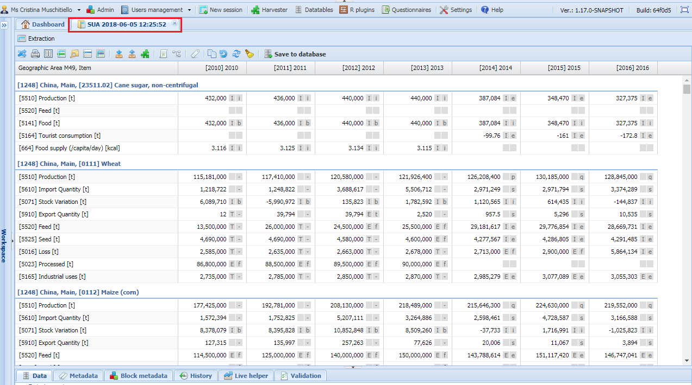
```

As previously mentioned, for the execution of the plugin and an easy managing of the operations, is better to rename the Session in a consistent and easily recognizable way.

### Rename session

This session has the name that has been generated automatically from the SWS: *SUA 2018-06-05 12:25:52* representing the data-set, day and time of the creation of the Session. 
As reported in figures \ref{fig:f11} to \ref{fig:f13}:
 1. Right click on the session name
 2. Select "Rename"
 3. Assign a name
 4. click "ok"

```{r f11, fig.align = "center", fig.pos = "H", out.width = "100%",  fig.cap = "\\label{fig:f11}Rename Session - 1"}

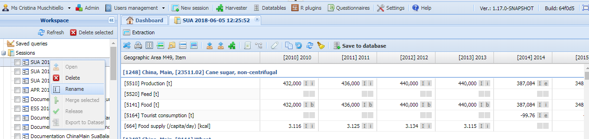
```

```{r f12, fig.align = "center", fig.pos = "H", out.width = "100%",  fig.cap = "\\label{fig:f12}Rename Session - 2"}

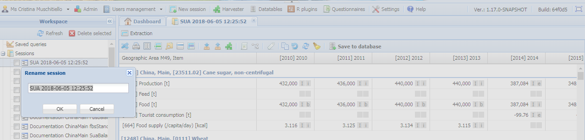
```

```{r f13, fig.align = "center", fig.pos = "H", out.width = "100%",  fig.cap = "\\label{fig:f13}Rename Session - 3"}

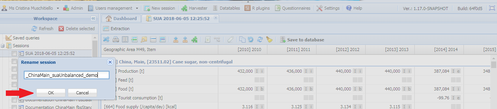
```

## `sua-balanced` session

A second session has to be opened on the domain:data-set *SUA/FBS:sua_balanced*. 

### Make and run the query on the session/Duplicate Session

This can be one in two ways. One can re-do all the steps for a new session, as reported in figures from \ref{fig:f14} to \ref{fig:f17} or *Duplicate* a session.

```{r f14, fig.align = "center", fig.pos = "H", out.width = "100%",  fig.cap = "\\label{fig:f14}Sua balanced session - 1"}

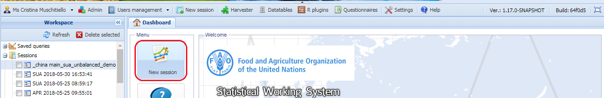
```


```{r f15, fig.align = "center", fig.pos = "H", out.width = "100%",  fig.cap = "\\label{fig:f15}Sua balanced session - 2"}

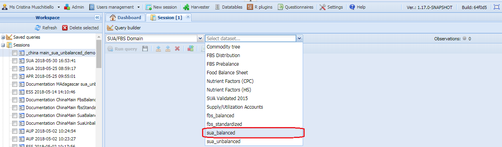
```

```{r f16, fig.align = "center", fig.pos = "H", out.width = "100%",  fig.cap = "\\label{fig:f16}Sua balanced session - 3"}

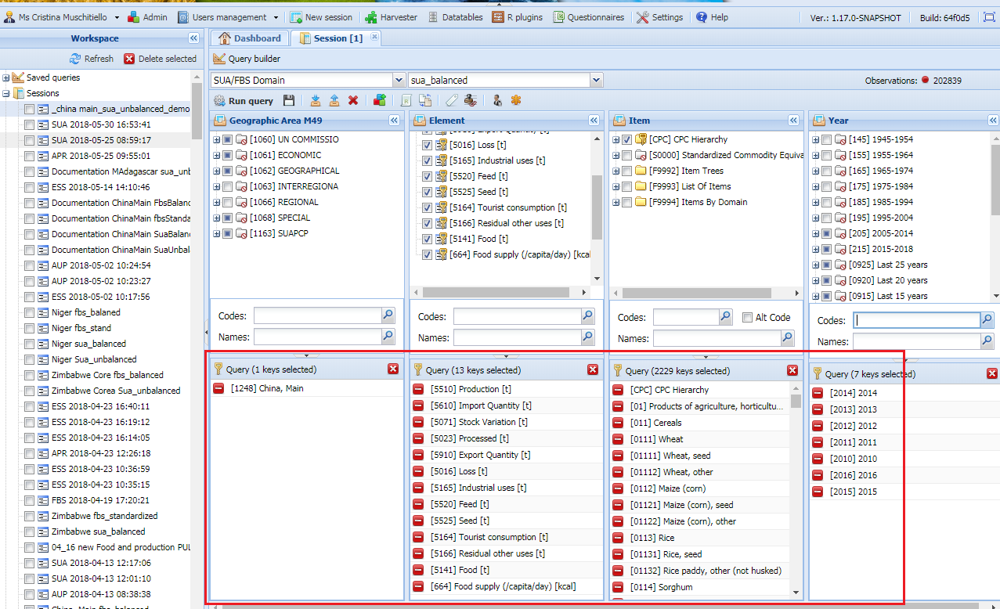
```

```{r f17, fig.align = "center", fig.pos = "H", out.width = "100%",  fig.cap = "\\label{fig:f17}Sua balanced session - 4"}

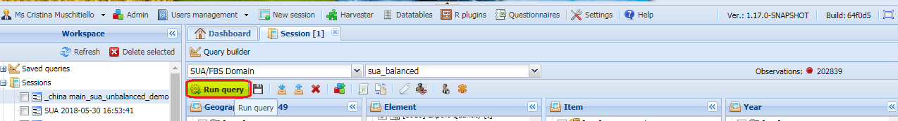
```

Instead of re-doing all these step, an alternative is that of ***duplicate*** a session. 
Indeed, any time one want to create a session on the same data-set of another or on a different data-set but same set of data, is possible to select the *duplicate session* button (figure \ref{fig:f18}). The *Duplicate Session* option open a new window with a pre-set query identical to the one from which the session is duplicated. This new pre-set query is still open for changes, therefore, from here is possible to change the data-set and obtain the new session without having to select again all the variables. In our example one should do the *duplicate session* on the *sua_unbalanced* table and then change the data-set to *sua_balanced* (figure \ref{fig:f19}). This would allow for saving time in creating the new session on the second data-set, just selection the desired data-set and then running the query

```{r f18, fig.align = "center", fig.pos = "H", out.width = "100%",  fig.cap = "\\label{fig:f18}Duplicate Session on sua unbalanced - 1"}

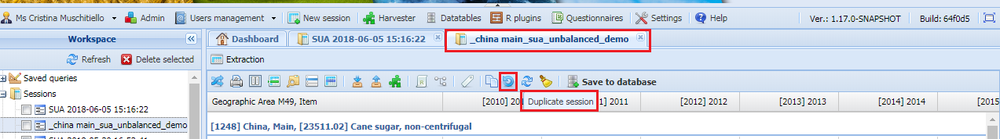
```

```{r f19, fig.align = "center", fig.pos = "H", out.width = "100%",  fig.cap = "\\label{fig:f19}Duplicate Session on sua unbalanced - 2"}

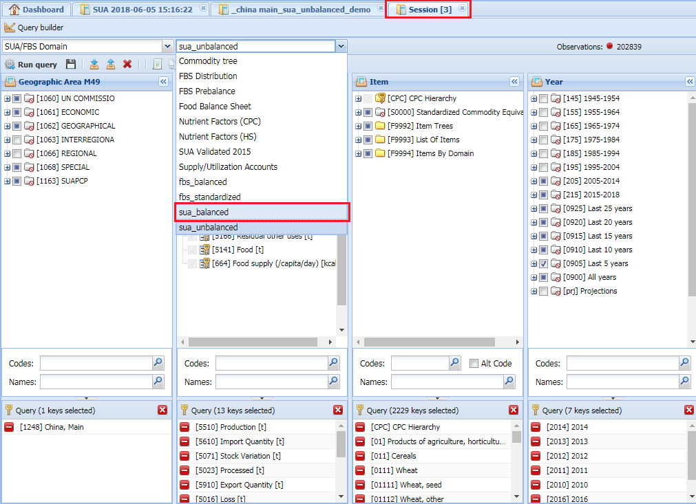
```

### Session content

Also *sua_balanced* data-set has been filled with *data coming from the old system (dataset "suaValidated2015"), from 2000 to 2013 for* ***all countries*** *and New data from 2014 onward*.

### Rename session

Also this session has to be renamed (figure \ref{fig:f20}).

```{r f20, fig.align = "center", fig.pos = "H", out.width = "100%",  fig.cap = "\\label{fig:f20}Rename session sua balanced"}

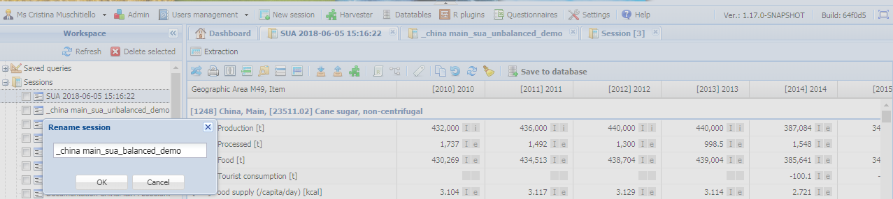
```

## `fbs-standardized` session

This session is created using exactly the same steps just explained for the previous one. After the execution, the session has to be renamed. 

### Make and run the query on the session/Duplicate Session

```{r f21, fig.align = "center", fig.pos = "H", out.width = "100%",  fig.cap = "\\label{fig:f21}Duplicate balanced session in the fbs standardized dataset"}

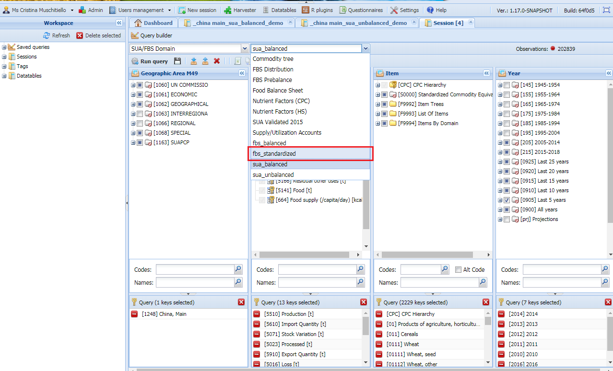
```

### Session content

Because the old system did no have this intermediate step and there was no old data stored to copy, this data-set has blank valued up to 2013 and new data from 2014. The new data are available for countries that have been already processed for FBS.

### Rename session

```{r f22, fig.align = "center", fig.pos = "H", out.width = "100%",  fig.cap = "\\label{fig:f22}Rename session fbs standardized"}

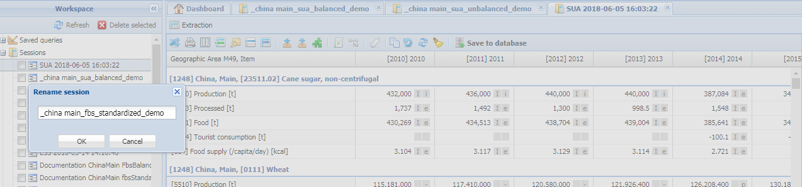
```

## `fbs-balanced` session

This is the main output data-set. 

### Make and run the query on the session/Duplicate Session

In the use of the *duplicate session* option all the FBS item have to be selected in addition to the CPC, because this data-set do not contain CPC item, therefore the session would come empty^[this is just a visualization need, in the sense that even if the session is empty, it would be filled anyway after the plug-in will be run. Anyhow, the previous years would not be visualized if the FBS item are not selected]. Also nutritive factors have to be selected in this step (figure \ref{fig:f23})

```{r f23, fig.align = "center", fig.pos = "H", out.width = "100%",  fig.cap = "\\label{fig:f23}Dupicate fbs Standardized"}

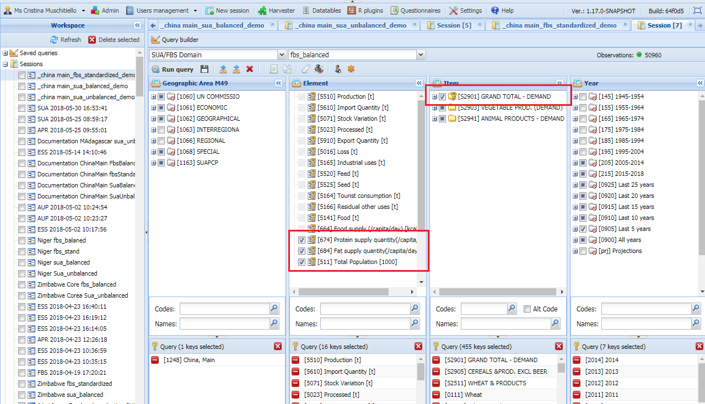
```

### Session content

FBS data coming from the old System are stored here from 2000 to 2013, while new FBS data are stored from 2014 onward. The new data are available for countries that have been already processed for FBS.

### Rename session

Rename as the other data-sets. 

```{r f24, fig.align = "center", fig.pos = "H", out.width = "100%",  fig.cap = "\\label{fig:f24}Rename fbs balanced"}

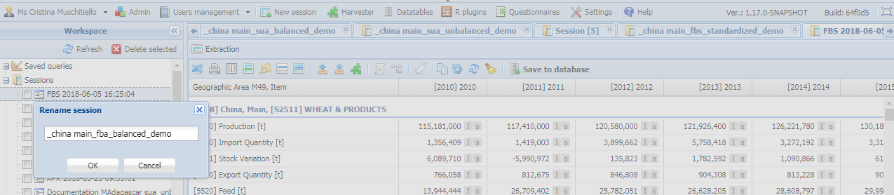
```

# Select plug-in

In the plug-in window, elect the `Full Standardization and Balancing` Plug-in.
This opens the window in figure \ref{fig:f27}.

```{r f25, fig.align = "center", fig.pos = "H", out.width = "100%",  fig.cap = "\\label{fig:f25}Select plug-in"}

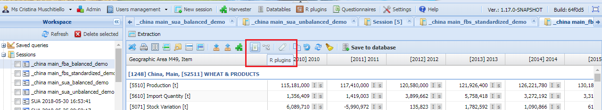
```

```{r f26, fig.align = "center", fig.pos = "H", out.width = "100%",  fig.cap = "\\label{fig:f26}Plug-in window"}

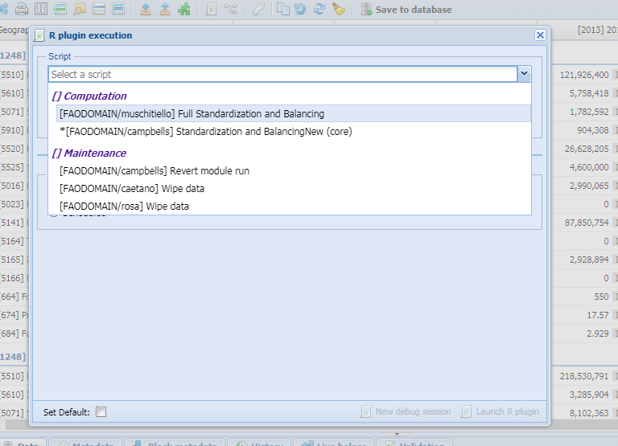
```

```{r f27, fig.align = "center", fig.pos = "H", out.width = "100%",  fig.cap = "\\label{fig:f27}Plug-in parameters - 1"}

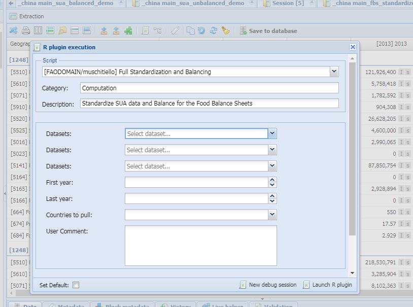
```

There are 3 *Dataset* sections. These are made for specifying the sessions in which output data have to be saved. The name of the dataset is reported in the fist line, while the name of the sessions are in the followin lines (figure \ref{fig:f28}). From the drop-down menu, elect the session you are working in (figures \ref{fig:f28} and \ref{fig:f29}).

```{r f28, fig.align = "center", fig.pos = "H", out.width = "100%",  fig.cap = "\\label{fig:f28}Plug-in parameters - 2"}

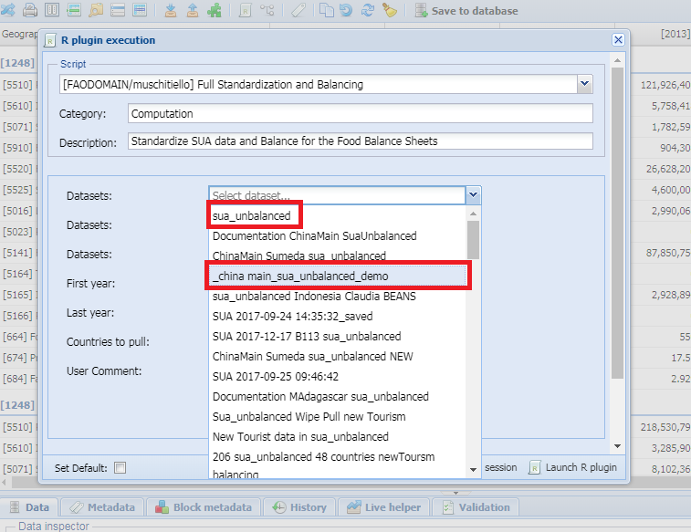
```

ALso the time range has to be selected here, which may or may not be the same as the time range you have selected in the session. In our example, the session has the time range 2010-2016 but the standardization is run for the period 2014-2016.


Finally, also the cuntries have to be selected. In particular, is possibel to select *all countries* or *session countries* (figure \ref{fig:f29}).


```{r f29, fig.align = "center", fig.pos = "H", out.width = "100%",  fig.cap = "\\label{fig:f29}Plug-in parameters - 3"}

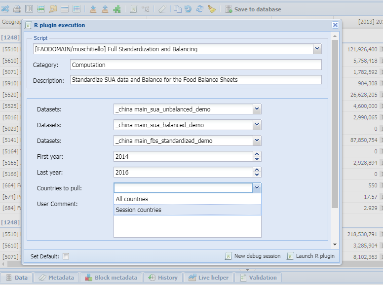
```

After all parameters are set, just launch the plug-in (figure \ref{fig:f30}). 

```{r f30, fig.align = "center", fig.pos = "H", out.width = "100%",  fig.cap = "\\label{fig:f30}Launch Plug-in"}

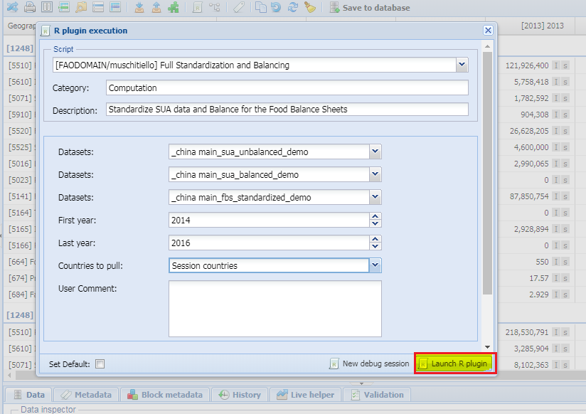
```

# Plug-in Run


```{r f31, fig.align = "center", fig.pos = "H", out.width = "100%",  fig.cap = "\\label{fig:f31}Tree Validation email - 1"}

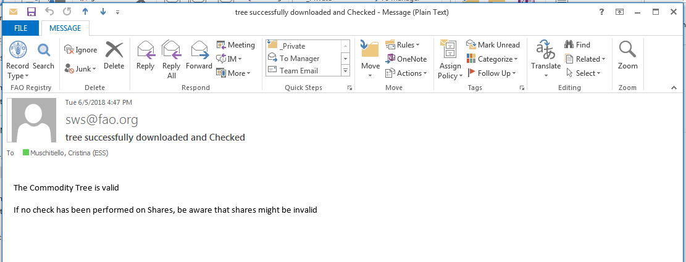
```

```{r f32, fig.align = "center", fig.pos = "H", out.width = "100%",  fig.cap = "\\label{fig:f32}Tree Validation email - 2"}

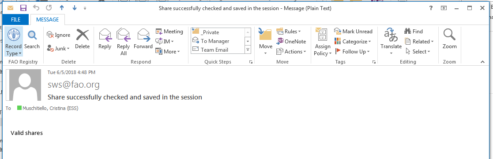
```

```{r f33, fig.align = "center", fig.pos = "H", out.width = "100%",  fig.cap = "\\label{fig:f33}Run message"}

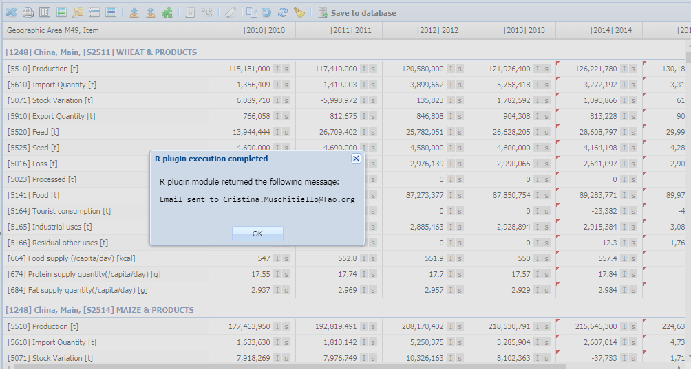
```

```{r f34, fig.align = "center", fig.pos = "H", out.width = "100%",  fig.cap = "\\label{fig:f34}Final email"}

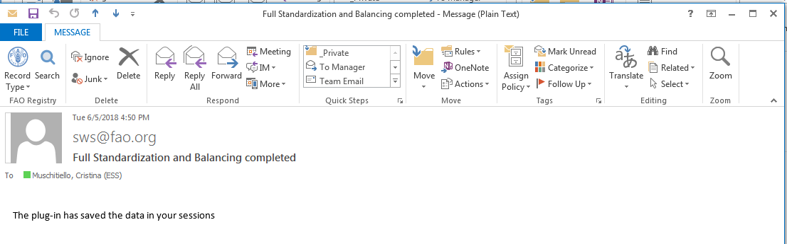
```

# The sessions after saving

## fbs_balanced session

```{r f35, fig.align = "center", fig.pos = "H", out.width = "100%",  fig.cap = "\\label{fig:f35}The session after the Run"}


```

## fbs_standardized session

```{r f36, fig.align = "center", fig.pos = "H", out.width = "100%",  fig.cap = "\\label{fig:f36}fbs standardized after the plug-in run"}

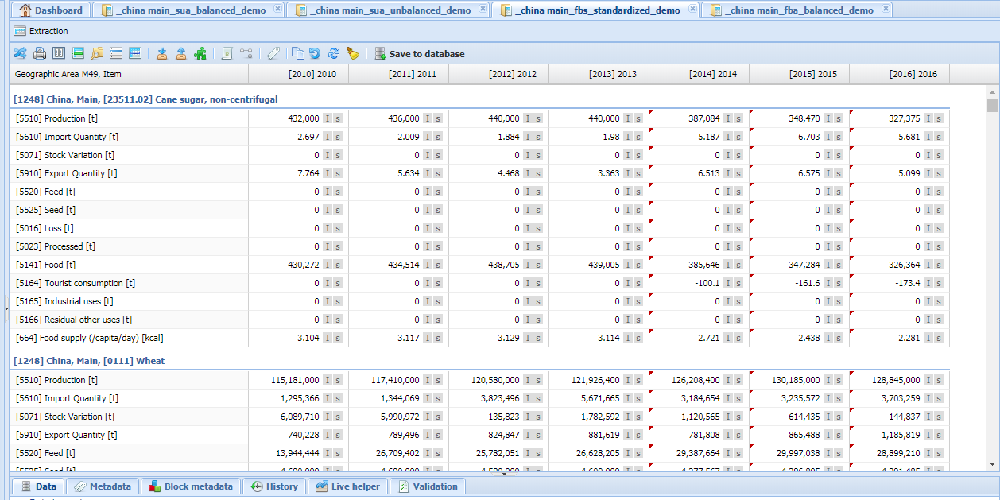
```

## sua_balanced session

update session 

```{r f37, fig.align = "center", fig.pos = "H", out.width = "100%",  fig.cap = "\\label{fig:f37}sua balanced after the plug-in run"}

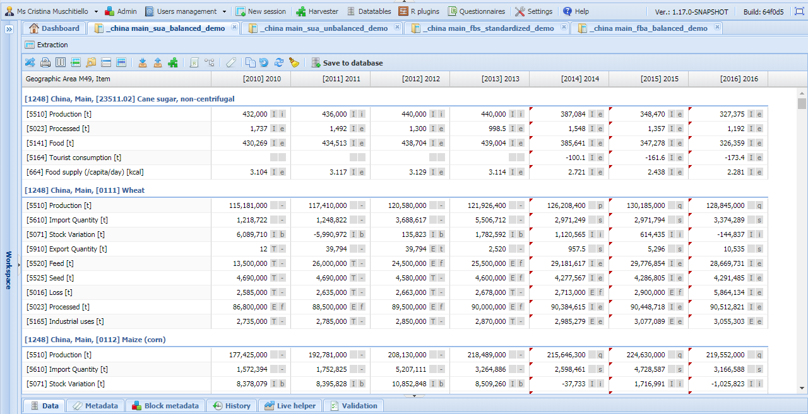
```


## sua_unbalanced session


# Final Save into the SWS


```{r f38, fig.align = "center", fig.pos = "H", out.width = "100%",  fig.cap = "\\label{fig:f38}Save Back to the SWS"}

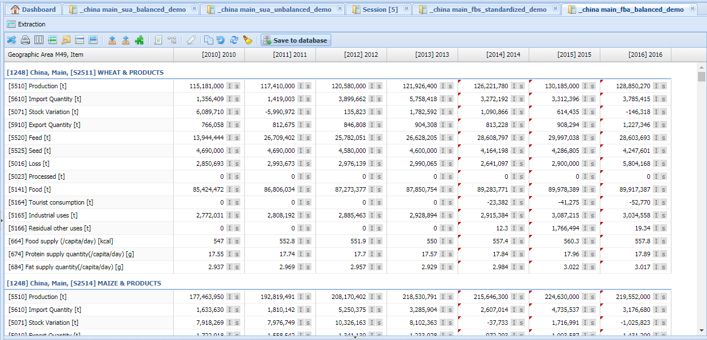
```

