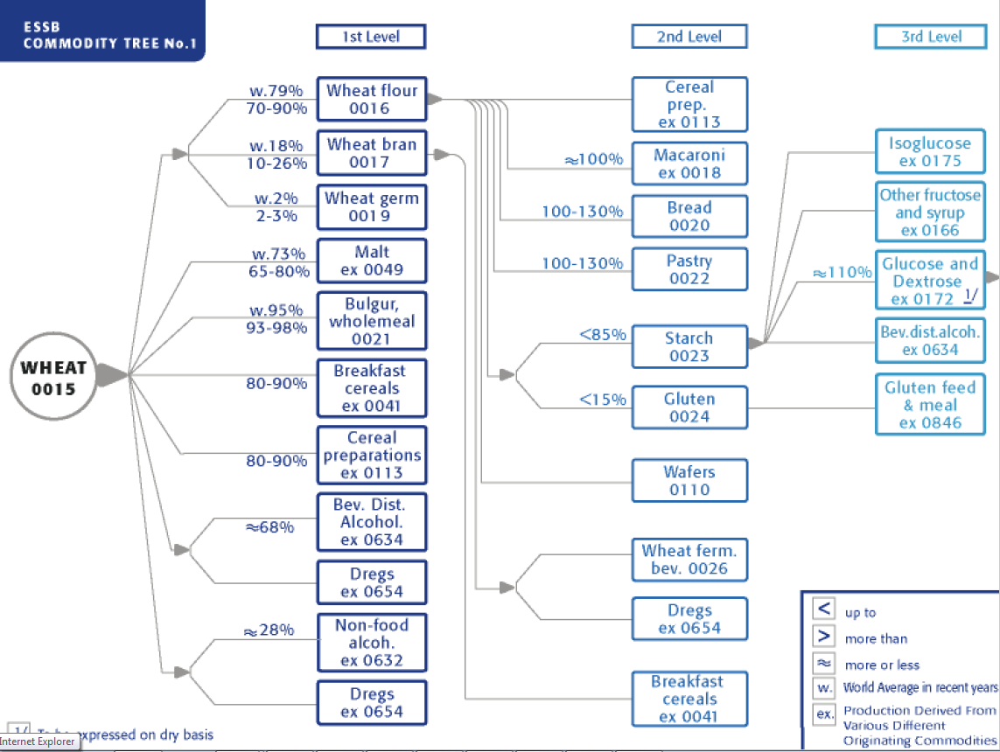
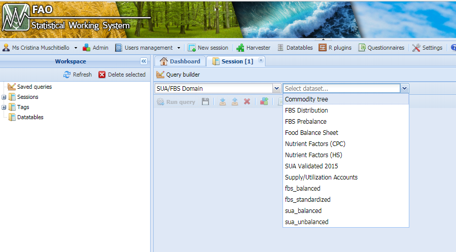
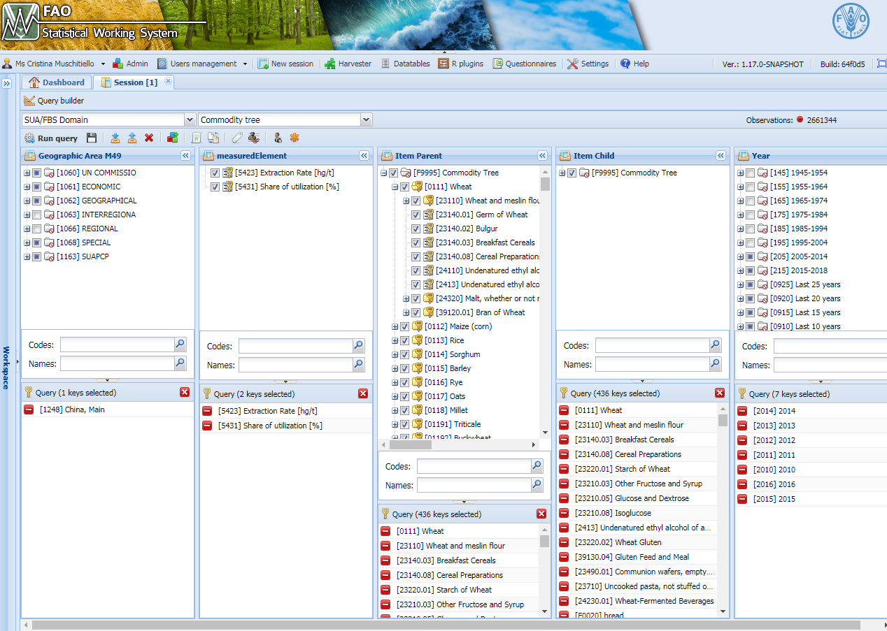
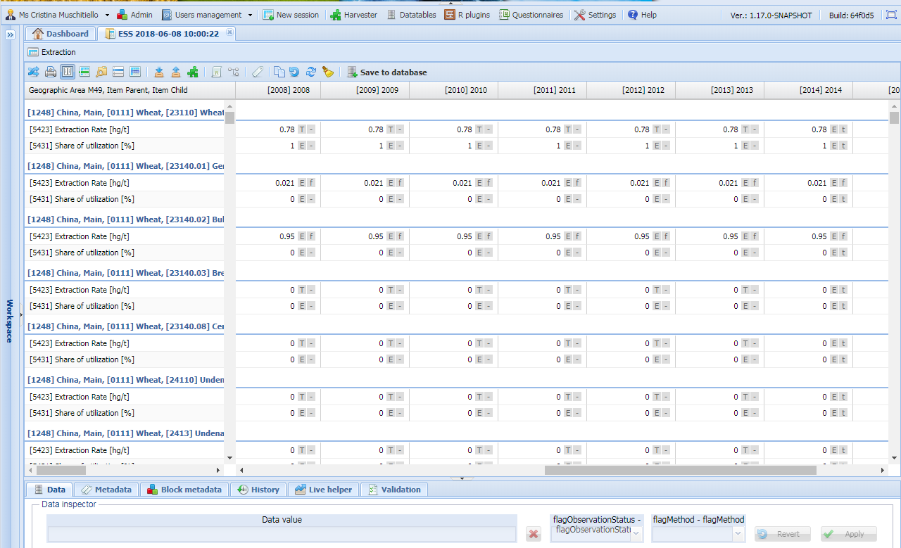

```{r setup, include=FALSE}
knitr::opts_chunk$set(echo = FALSE)
# local({
# r <- getOption("repos")
# r["faoswsCRAN"] <- "http://hqlprsws1.hq.un.fao.org/fao-sws-cran/"
# options(repos = r)
# })
## load the library
# library(faosws)
# library(faoswsUtil)
# library(faoswsBalancing)
# library(faoswsStandardization)
library(tinytex)
library(data.table)
library(igraph)
library(stringr)
library(dplyr)
library(MASS) 
library(lattice)
library(reshape2)
library(kableExtra)
library(captioner)
library(xtable)
```

```{r}
# DEFINE ALL TABLE NAMES AND CAPTIONS
table_nums <- captioner::captioner(prefix = "Table")

t1_cap <- table_nums(name = "t1",
                     caption = "Commodity Tree - China/Wheat/2014")

t2_cap <- table_nums(name = "t2", 
                        caption = "Flag combination in the Commodity tree data-set")

t3_cap <- table_nums(name = "t3", 
                        caption = "Sua table with Production filled/incremented - China/Wheat/2014 example")


```

\newpage

\listoftables

\listoffigures


## Disclaimer {-}

This Working Paper should not be reported as representing the official view of
the FAO. The views expressed in this Working Paper are those of the
author and do not necessarily represent those of the FAO or FAO
policy. Working Papers describe research in progress by the authors and
are published to elicit comments and to further discussion.

This paper is dynamically generated on \today{} and is subject to
changes and updates.

\newpage

# Introduction

The process of combining commodity balances for creating Food Balance Sheets is explained in a separate document^[see Standardization & Balancing for Food Balance Sheet Calculation]. The process is based on a structured and clear set of relationships between commodity given by the *Commodity tree*. 
The majority of the commodities are produced from one (or more) commodity (/ies), called *parent* commodity(/ies), and/or are themselves parent of one (or more) *child* (*children*) commodity (/ies). These structure creates an intense and articulated network of relationships at different levels: primary commodities, like crops, are *parent* commodities and, also, *zero-level* commodities from which *children* commodities of *level-1* are produced, which are in turn, used to produce other commodities of a gradually *"lower"* level. In commodity trees, the bigger the level number, the lower the processing level. There are as many commodity trees as the number of process chains in a country.
The reference document concerning the conversion factors from parent to processed commodity is  available in the documentation folder on [*GitHub*](https://github.com/SWS-Methodology/faoswsStandardization/tree/master/documentation). The document gives some generic as well as some country specific tcf. 
Other details are included in the following document: [*Flexible aggregation of FAO’s Supply Utilization Accounts*.](https://github.com/SWS-Methodology/faoswsStandardization/blob/master/documentation/flexible_aggregation_of_FAO_supply_utilization_account.pdf)

# Content

Commodity trees are presented in tables like `r table_nums("t1",display = "cite")`, which represents the Commodity tree of Wheat in China in the year 2014. 

```{r t1, fig.cap=t1_cap, fig.pos = "H"}
table=data.table(read.csv("tables/commodityTree/01_TreeChinaWheat.csv"))
knitr::kable(table,caption = "Commodity Tree - China/Wheat/2014",
             align = c("r",rep("l",length(colnames(table))-1)))

```

In the table:

 - each production process is represented in a separate row. 
 - *Wheat and meslin flour* and *Bran of wheat* are both produced from Wheat. 
 - From 1 unit of Wheat 0.78 units of Flour is produced and 0.22 units of Bran of wheat^[tons is the usual measurement unit for wheat]. 
 - *Wheat and meslin flour* is produced 100% from Wheat, as well as *Bran of Wheat*. This information is contained in the *share* equal to 1.
 - From *Wheat and meslin flour* 6 different processed commodities are produced (in China). All of them but 2 have an extraction rate equal to 1, meaning that 1 unit is produced from each unit of flour. *Starch of Wheat* and *Wheat Gluten* have a smaller extraction rate instead. 
- *Gluten feed and meal* can be produced both from *Wheat Gluten* and from *Bran of Maize*^[This commodity pertain to the *Maize* commodity tree, but is reported here for explaining this Tree]. In particular: in this country 33% of *Gluten feed and meal* comes from *Wheat Gluten* and 67% from *Bran of Maize*. 

Each production process is, therefore, represented by two main values: *extraction rate* and *share*.

## Extraction Rates

***Extraction rates*** ($eR$) represent how much amount of the child commodity is produced from 1 unit of parent commodity. In the table they are reported as ratios, other time they can be presented as percentages. Extraction Rates may differ fro country to country and, in the same country, from year to year, for example if the country changes one production process for some commodity. In Commodity Tree tables, extraction rates may be equal to 0 or NA. In both cases this means that the production process expressed in the specific line is possible (i.e. some other country has or has had it) but for that specific year in that country it is not active.

Extraction rates are fixed, they are determined once and remains fixed for the specific year. For following year they might:

- change, if the Country communicate that something has changed in the way it produces some specific commodity
- appear, if not existing before, when a country starts producing commodities it was not producing in the past
- disappear, if the country deactivates some production process.

## Shares

Some child commodity can be produced starting from more that one parent commodity. ***Shares *** represents the amount of a child commodity that is produced from each parent commodity. Shares can be expressed as ratio or percentage. 

In the previous Food Balance Sheet Framework shares were given a-priori. They were given by country and were fixed, as the extraction rates. Each share represented the amount of a 
*parent commodity* used for producing each processed commodity. In other words, shares were *parent-specified* and given *a-priori*

In the new FBS framework, Shares are *endogenously* calculated inside the process of standardization. Shares are based on actual availabilities and are *child-specified*. In general terms, *shares* are given by: 
 
\begin{equation}
\label{eq:sharesGen}
s_{cp} = \frac{availability_{p(c)}}{\sum \limits_{p=1}^A{availability_{p(c)}}}
\end{equation}

where $availability_{p(c)}$ is the availability of each parent $p$ of child $c$ expressed in terms of $c$ (in *child equivalent*). 

Shares are calculated twice during the standardization process, using two different *availabilities.* 

1. During Food Processing calculation. 

> Food processing is the amount of the supply of a commodity processed into derived commodities. Food processing is calculated for all the parent commodities as the sum of the food processing of all the possible derived commodities. For its calculation only the amount of each child that is actually being produced by one parent has to be used. Therefore, a ratio representing how much of a child has to be back used is given by the *share* defined as $s^1_{cp}$:

> \begin{equation}
\label{eq:shares}
s^{1}_{cp} = \frac{availability1_{p(c)}}{\sum \limits_{p=1}^A{availability1_{p(c)}}}
\end{equation}

> where $availability1_{p(c)}$ is the availability of each parent $p$ of child $c$ expressed in terms of $c$ (as say in *child equivalent*) defined as: 

> \begin{equation}
\label{eq:availability 1}
availability1_{p(c)} = (P_{pjt} + I_{pjt} - X_{pjt})\times eR_{p\to c}
\end{equation}

> where $P$=Production, $I$=Imports and $X$=Exports and where the $i$ index runs over all countries, the $j$ index over all commodities, and $t$ over years.

> Here, the amount *available* of each parent is represented by a reduced version of the concept of Total Supply (TS). Indeed $TS = P + I - X \pm \Delta S$ ($\Delta S$ representing changes in stock). Anyhow here stocks are not used, because the model imputing stock is considered as needing refinement and the stock figures proved to create deep fluctuations in results.

2. During Standardization.

> When the Standardization happens, each commodity is tranformed in its parent equivalent. A ratio specifying how much of each child has to be back standardizaed is needed also in this step. This time the amount of each parent *available* for the processing if the *Food Processing*, therefore, in the definition of $s^2_{cp}$ the availability is the Food Processing ($FP$): 

> \begin{equation}
\label{eq:shares}
s^{2}_{cp} = \cfrac{availability2_{p(c)}}{\sum \limits_{p=1}^A{availability2_{p(c)}}}
\end{equation}

> and 

> \begin{equation}
\label{eq:availability2}
availability2_{p(c)} = FP_{p}\times eR_{p\to c}
\end{equation}

# Representation

Commodity tree are ofnet visualized and explored in a flowchart frorm of the kind presented in Figure \ref{fig:f1}. The figure is a screenshot from the *tcf* document where:

 * ***nodes*** represent commodities, 
 * ***edges*** represent production processes ,
 * ***joints*** indicate where a single production process creates more that one commodity. These commodities are, then, called *by-products* or *co-products*.

In the image a *general* commodity tree is presented for Wheat. Percentages reported are average extraction rates from the parent to the child commodity. Intervals and average values calculated on all countries are reported. Moreover, in some cases $eR$s are not reported. 
Commodity trees in graphic form do NOT exist for all countries in these document, nor in other documents.

Indeed, not all the countries have the same production processes: countries have different technologies and primary products availabilities. Therefore, the commodity trees are not the same across countries and, sometimes, across years. Nevertheless, specific country-commodity-year trees do exist. For example, for China Mainland in 2014, the commodity tree would be the one reported in \ref{fig:f2} and in `r table_nums("t1",display = "cite")`.

```{r f1, fig.align = "center", fig.pos = "H", out.width = "100%",  fig.cap = "\\label{fig:f1}Commodity Tree for Wheat from the tcf document"}


```


```{r f2, fig.align = "center", fig.pos = "H", out.width = "90%",  fig.cap = "\\label{fig:f2}Commodity Tree China Mainland, Wheat, 2014"}

knitr::include_graphics("images/commodityTree/02_WheatTree.pdf")
```

In the SWS (Statistical Working System of FAO) country-commodity-years commodity trees are stored in dedicated Data-sets.  

# Commodity Tree in the SWS

Extraction rates and shares are stored  the SWS in the following places. 

1. *Shares* from the old FBS system are stored in the `agriculture:aupus share` data-set

> *Shares* in the new framework are always endogenously computed, therefore these values have never been used in this context. 

2. $eR$ from the old FBS system are stored in the `agriculture:aupus ratio` data-set. These ratios were copied from the old system and used in the new system.

> During the implementation and test of the new methodology, it was realized that the information stored in the mentioned data-set was not complete. Old data were then analyzed and real etraction rates extracted and tested. The new values are now stored in another data-set

3. New Extraction Rates are stored in the `SUA/FBS:Commodity tree` dataset. These values were obtained by extracting old $eR$ from SUA tables of the old system in the time range 2000-2010. These values were applyed in new SUA tables and The Foos Balance Sheets obtained were compared with those already plublished in the same time-range. When the two FBS time series matched, the $eR$ were considered validated in that time range. Also *shares* were tested in this exercise and saved in the data-set. However, these shares represent a "memory" of the old values, but are never used. 

## `SUA/FBS:Commodity tree` data-set.

The `Commodity tree` dataset is in the `SUA/FBS` domain. Figures \ref{fig:f3} and figure \ref{fig:f4} reports an example on China Mainland. When opening a session the following variables have to be specified: 

 - Country
 - Elements. Here only two elements are available: Extraction rates and Shares
 - Parent Item
 - Child Item
 - Time Range

```{r f3, fig.align = "center", fig.pos = "H", out.width = "90%",  fig.cap = "\\label{fig:f3}Selection of the Commodity Treee dataset"}


```


```{r f4, fig.align = "center", fig.pos = "H", out.width = "90%",  fig.cap = "\\label{fig:f4}Selection of parameter in the Commodity Tree - China Mainland example"}


```

As reported in figure \ref{fig:f5} commodity are listed by country and for each country:commodity the two variables are displayed. 


```{r f5, fig.align = "center", fig.pos = "H", out.width = "90%",  fig.cap = "\\label{fig:f5}Commodity Tree session - China Mainland example"}


```

The dtaset contains: 

1. ***Extraction rates***:

 - Extraction rates 2000-2013: these $eR$ are taken from the old framework. These Extraction rates have been validated in this time window (2000-2013). 
 - Extraction rates from 2014 onwards: From 2014 onwards Extraction rates of 2013 have been copied.
 
> Extraction rates are not modified during the standardization process. They can be manually changed. When this happens, manually inserted figures are considered protected and preferred over the others. 

2. ***Shares***:

 - Shares 2000-2013: these shares are taken from the old framework. These shares have been validated in this time window (2000-2013). 
 - Shares from 2014 onwards: From 2014 onwards shares of 2013 have been copied. 

> Shares are recalculated at each module run. An exception is represented by **shares of oils**. Because oils hystorically have had problems, shares for these commodities is not recalculated but old shares are used. Shares can also been manually modified. When it happens, the manual value is used instead, but only after a check is performed on the consistency of the value. 

\newpage

## Flag combinations and interpretation

Different flags are used for identify the tipology of value in the dataset. The following flags and meanings have been agreed: 

\begin{table}[h]
\caption {Flag combination in the Commodity tree data-set}
\centering
\begin{tabular}{|l|l|l|}
\toprule
\bf{Variable} & \bf{Flag Combination} & \bf{Meaning}\\ 
\midrule
\multirow{4}{*}{Extraction Rate} & $(T , -)$  & validated up do 2013 - protected \\
\cline{2-3}
& \multirow{2}{*}{$(E , t)$}  &   copied from 2014 onwards - NOT protected \\
& &  (do not change during standardization process)\\ 
\cline{2-3}
& $(E , f)$  &   manually changed by the user – protected\\ 
\cline{1-3}
\multirow{5}{*}{Share} & \multirow{3}{*}{$(E , -)$}  & coming from old methodology - NOT protected.\\
& &  (overwritten at any run of the module, except the values of oils\\
& &   which are kept, unless manually changed) \\
\cline{2-3}
& $(E , f)$  &  manually changed by the user - protected\\ 
\cline{2-3}
& $(I , i)$  &   calculated by the module - not protected\\ 
\cline{1-3}
\end{tabular}
\end{table}

## Validity check functions

Because `Commodity tree` data-set is already used in more that 1 module and because in the future it might be used for other purposes, 3 validity fuctions have been created. These functions are included in the [*faoswsUtil* package](https://sdlc.fao.org/bitbucket/projects/SWS/repos/faoswsutil/browse/R). 

### `validateTreeExtractionRates.R`

This function performs 2 checks: 

1. if the values are outside a reasonable range that can be manually set and that, by default is 0-10
2. If the flags are outside those listed in `r table_nums("t2",display = "cite")`

it just returns a list of the invalid rows (if any) and a message.

### `validateTreeShares.R`

This function performs 2 checks: 

1. if the values are outside the range 0-1
2. If the flags are outside those listed in `r table_nums("t2",display = "cite")`

it just returns a list of the invalid rows (if any) and a message.


### `validateTree.R`

This function aggregates the validation of shares and Trees and sends emails containing a message saying that Extraction rates and/or shares are ok or, if anything is not correct, a csv file containing the wrong lines.


