```{r setup, include=FALSE}
knitr::opts_chunk$set(echo = FALSE)
# local({
# r <- getOption("repos")
# r["faoswsCRAN"] <- "http://hqlprsws1.hq.un.fao.org/fao-sws-cran/"
# options(repos = r)
# })
## load the library
# library(faosws)
# library(faoswsUtil)
# library(faoswsBalancing)
# library(faoswsStandardization)
library(tinytex)
library(data.table)
library(igraph)
library(stringr)
library(dplyr)
library(MASS) 
library(lattice)
library(reshape2)
library(kableExtra)
library(captioner)
library(xtable)
```

```{r}
# DEFINE ALL TABLE NAMES AND CAPTIONS
table_nums <- captioner::captioner(prefix = "Table")

t1_cap <- table_nums(name = "t1",
                     caption = "Commodity Tree - China/Wheat/2014")

t2_cap <- table_nums(name = "t2", 
                        caption = "Flag combination in the Commodity tree data-set")

t3_cap <- table_nums(name = "t3", 
                        caption = "Sua table with Production filled/incremented - China/Wheat/2014 example")


```

\newpage

\listoftables

\listoffigures


## Disclaimer {-}

This Working Paper should not be reported as representing the official view of
the FAO. The views expressed in this Working Paper are those of the
author and do not necessarily represent those of the FAO or FAO
policy. Working Papers describe research in progress by the authors and
are published to elicit comments and to further discussion.

This paper is dynamically generated on \today{} and is subject to
changes and updates.

\newpage

# Introduction 

The process of combining commodity balances for creating Food Balance Sheets is explained in a separate document^[see Standardization & Balancing for Food Balance Sheet Calculation]. The process is based on a structured and clear set of relationships between commodity given by the *Commodity tree* which is also explained in another document. The *Standardization and Balancing* generates balances for FBS commodities at different levels of aggregation: by FBS item, by group, by family and Total (by country).
The `printTree` plug-in performs the all process (as the `Full standardization and balancing does`) but only for a single FBS item's  SUA. It saves the different outputs, plus some detail about commodity tree, extraction rates and shares in a .md file and send it to the user for easy consultation. 

One of the main drawbacks of the structure of plug-ins and processes in the SWS for FBSs calculation is the fact of having pieces of information separated in different data-tables and data-sets. This makes it a bit complicated for a user to have the full picture of a country when is trying to validate a Food Balance Sheet. For this reason, a tool has been created for having slices of country information in a single document. Indeed, the complexity of the Food Balance Sheet makes it not possible to have all pieces of information together. In particular, FBSs have many dimensions: countries, FBS commodities, years, SUAs. Also, there are many ways of looking at the data: by country, by year, by FBS commodity by step of the process and so on.

The SWS shows the data in data-sets representing different step of the process. These data-sets are ordered by country, commodity and year. This structure is not the best in many cases fr a user. The `printTree` plug-in shows, for a selected FBS item, country and year, the different tables in a unique document. 

# Content (the output of the plug-in)

The output of the plug-in is a `.md` file that is better red by *Notepad ++*. The name of the document is: 

`year_M49_sample_test.md`, for example: `2014_1248_sample_test.md`, where 1248 is the M49 code for China Mainland. It is composed the following parts: 

## `sua_unbalanced`

First, the `Sua Unbalanced` if shown for the FBS item selected. In the example of figure \ref{fig:f1} The Sua for the FBS item *WHEAT & PRODUCTS* is shown. This means that all the CPC commodities of the Commodity Tree of Wheat are shown, plus the commodities that will be aggregated in the FBS item *WHEAT & PRODUCTS* but are NOT in the commodity Tree of Wheat: *Food PReparations* and *Mixes and dougths*^[a more detailed description of the commodities included in the sua_unbalanced table is contained in the methodological document of *Standardization and Balancing*].

## `sua_unbalanced + Production filled`

The first step of the Sua Filling is the creation/increment of production for derived commodities. The overall process is described in the methodological document of Standardization and Balancing. 

The result of this step is reported in the second part of the printTree document (figure \ref{fig:f2}). Any change from the previous table is reported with 3 asterisk (***) before and after. 

\newpage
\begin{landscape}
```{r f1, fig.align = "center", fig.pos = "H", out.width = "100%",  fig.cap = "\\label{fig:f1}printTree output 1 - sua unbalanced"}

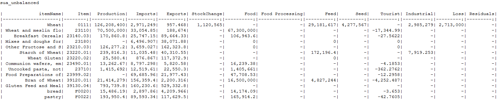
```

```{r f2, fig.align = "center", fig.pos = "H", out.width = "100%",  fig.cap = "\\label{fig:f2}printTree output 2 - sua unbalanced with production"}

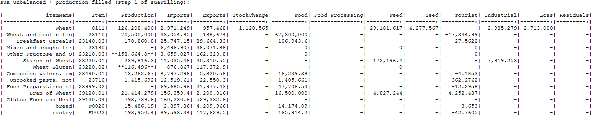
```
\end{landscape}

## Availabilities, extraction rates and shares for Food Processing calculation

The document includes the table with extraction Rates, shares, weights and availabilities (figure \ref{fig:f3}) used for the next step, which is the calculation of Food Processing. Please notice that here, not just the portion of commodity tree of Wheat is reported, but also any other related commodity. In particular, with *related* commodity is meant that, if a child of the commodity tree of wheat, is also child of dome other commodity of some other tree, also this commodity is reported, because is related to that child of wheat. This additional commodity will be also shown in the next steps because its figures might change, and actually change, when the figure of the FBS wheat tree change. 


```{r f3, fig.align = "center", fig.pos = "H", out.width = "90%",  fig.cap = "\\label{fig:f3}printTree output 3 - availabilities, extraction rates and shares for Food Processing calculation"}

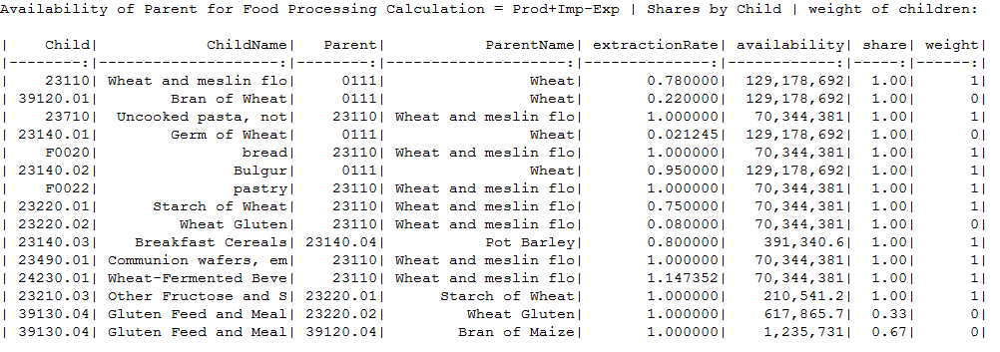
```

## `sua_unbalanced + Production filled + Food Processing`

From table in figure \ref{fig:f3},  Food processing (\ref{fig:f24}) can be better understood. Also in figure \ref{fig:f4} Any change from the previous table is reported with 3 asterisk (***) before and after.

## `sua_balanced` and Nutrient Values

After food processing, the sua filling compute/change any other figure that is required. The result is the sua_unbalanced table (figure \ref{fig:f4}). The table also reports the DES (Dietary Energy Supply). Indeed, as described in the methodological document, DES is based on food quantities at this step of the process.

\newpage
\begin{landscape}
```{r f4, fig.align = "center", fig.pos = "H", out.width = "100%",  fig.cap = "\\label{fig:f4}printTree output 4 - sua unbalanced with Food Processing"}

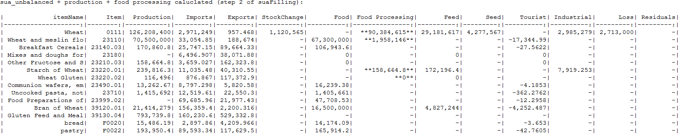
```

```{r f5, fig.align = "center", fig.pos = "H", out.width = "100%",  fig.cap = "\\label{fig:f5}printTree output 5 - sua balanced (after Sua Filling)"}

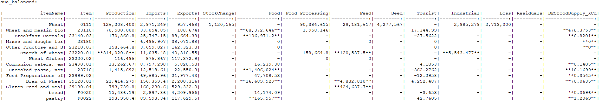
```
\end{landscape}

## Availabilities, extraction rates and shares for Standardization

Also for Standardization, a table extracted from the commodity tree is reported, with Availability, extraction rates, shares and weights. Also in this case, *related* commodities are shown.

```{r f6, fig.align = "center", fig.pos = "H", out.width = "90%",  fig.cap = "\\label{fig:f6}printTree output 6 - availabilities, extraction rates and shares for standardization"}

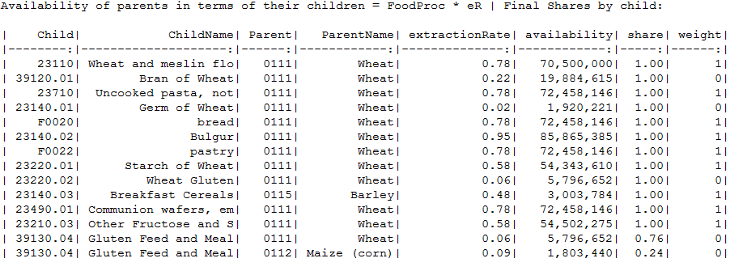
```

## `fbs_standardized` 

figure \ref{fig:f7} shows the result of standardization. Only zero-level commodities are reported in this table. Again any change from the previous table is reported with 3 asterisk (***) before and after.

## `fbs_balanced` and adjustment of Nutrient Values 

Two tables are reported for balanced Food Balance Sheet. One for the quantities (figure \ref{fig:f8}) and one with the Nutrient values updated (figure \ref{fig:f9}).

## FBS aggregation

Finally, all the FBS item aggregated are reported. Also related FBS items are reported. Tables reported in figure \ref{fig:f9} contain all level of aggregations. 

All the tables presented are contained in a single document.

\newpage
\begin{landscape}
```{r f7, fig.align = "center", fig.pos = "H", out.width = "100%",  fig.cap = "\\label{fig:f7}printTree output 7 - fbs standardized"}

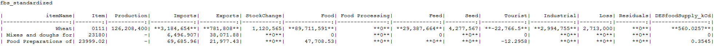
```

```{r f8, fig.align = "center", fig.pos = "H", out.width = "100%",  fig.cap = "\\label{fig:f8}printTree output 8 - fbs balanced and fbs balanced with nutrients updated"}

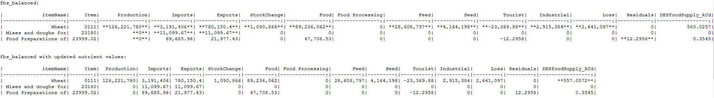
```

```{r f9, fig.align = "center", fig.pos = "H", out.width = "100%",  fig.cap = "\\label{fig:f9}printTree output 9 - FBS aggregations"}

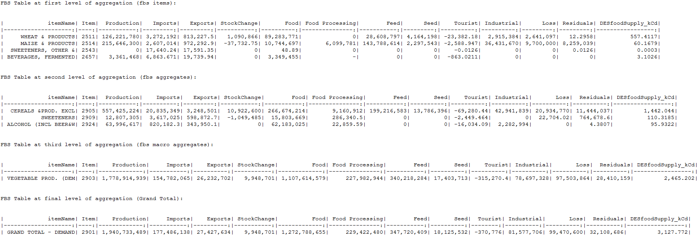
```
\end{landscape}

# `printTree` Plug-in

## Input dataset

The plug-in is selected and launched from the `sua_unbalanced` data-set.
Therefore, a session has to be opened in this data-set (figure \ref{fig:f10}). From the session, the *R plugins* section has to be opened and the `printTree` plug-in selected (figure \ref{fig:f11}).

```{r f10, fig.align = "center", fig.pos = "H", out.width = "100%",  fig.cap = "\\label{fig:f10}printTree plug-in: input dataset"}

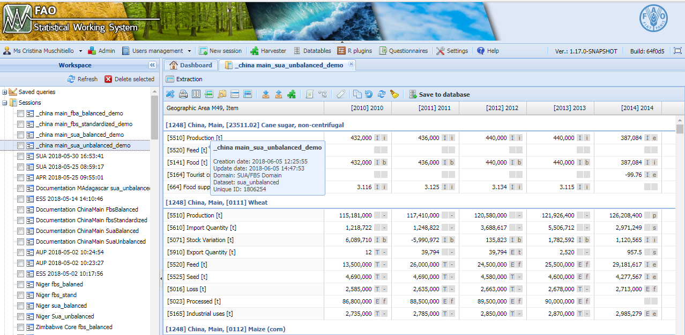
```

## Plug-in definition

```{r f11, fig.align = "center", fig.pos = "H", out.width = "100%",  fig.cap = "\\label{fig:f11}printTree plug-in: call plug-in window "}

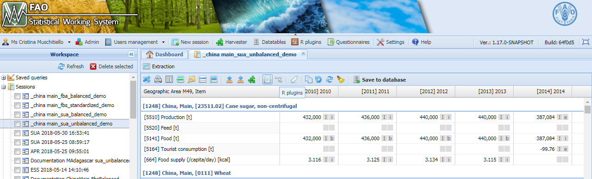
```


Figure \ref{fig:f12} shows the drop-down menu for the selection of the FBS item. Also first and last year have to be selected and the countries. Always *session country* is selected in this case (figure \ref{fig:f13}). 

```{r f12, fig.align = "center", fig.pos = "H", out.width = "80%",  fig.cap = "\\label{fig:f12}printTree plug-in: select FBS item from drop down menu"}

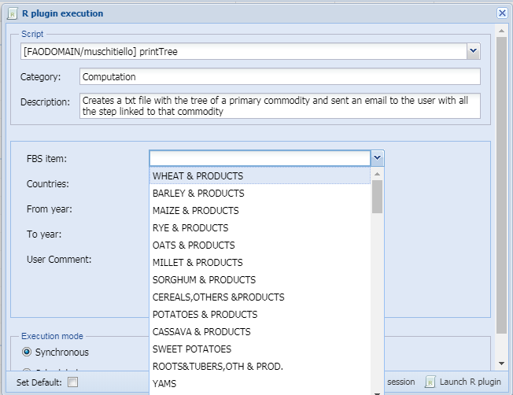
```

```{r f13, fig.align = "center", fig.pos = "H", out.width = "80%",  fig.cap = "\\label{fig:f13}printTree plug-in: select other parameters and run"}

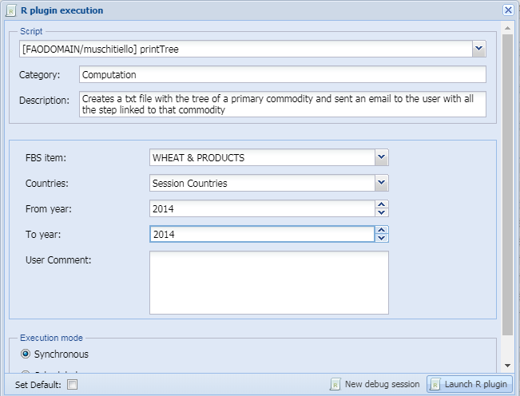
```

## Plug-in output

When the plug-in has run, an email is sent with an attached folder (figure \ref{fig:f14}). The folder includes other folder before reaching the file. This is due to the structure of the SWS server and for the moment is not possible to simplify this structure (figure \ref{fig:f15}).
Finally the file is contained, the content of which has been already explained. It has to be opened with *Notepad ++*.


```{r f14, fig.align = "center", fig.pos = "H", out.width = "80%",  fig.cap = "\\label{fig:f14}printTree plug-in: email"}

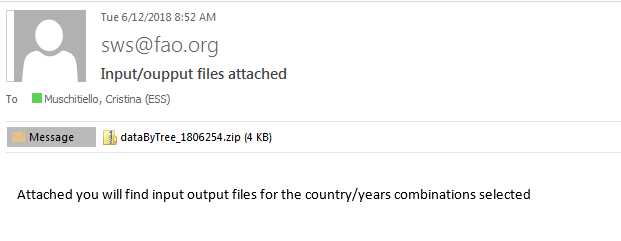
```


```{r f15, fig.align = "center", fig.pos = "H", out.width = "80%",  fig.cap = "\\label{fig:f15}printTree plug-in: folders"}

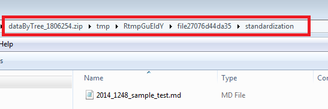
```
